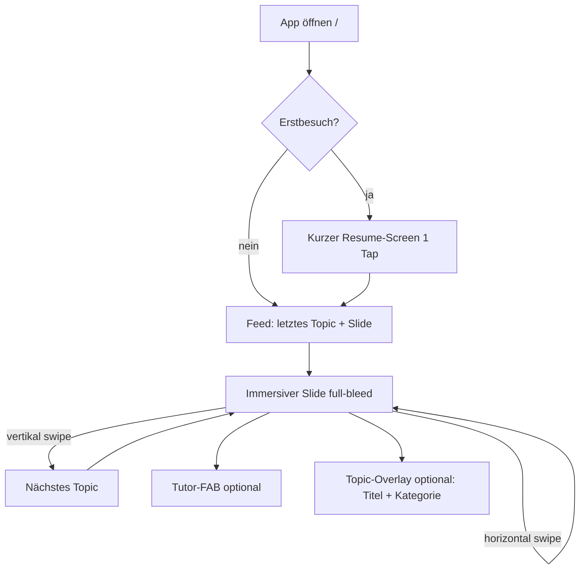

# Design: Feed UI v2 — Immersive Mobile Shell

<!-- drafted 2026-06-24 — closes gap between swipe mechanics and TikTok-like feel -->

## Problem & Intent

Questolin hat **funktionierende** vertikale/horizontale Swipe-Mechanik (Embla, `100dvh`), wirkt aber visuell wie eine **Lernkarten-App**: DaisyUI-Cards mit Padding, fester Topic-Header, sichtbare Zurück/Weiter-Buttons, Dot-Navigation und permanenter Swipe-Hinweis. Nutzer erwarten beim Öffnen ein **immersives, mobile-first Feed-Erlebnis** (TikTok/Reels-Pattern): voller Screen, minimaler Chrome, Swipe als primäre Interaktion.

**Ziel:** Optik und User Flow an die bestehende Swipe-Architektur anpassen — **ohne** Content-Layer oder Slide-Schema zu ändern.

## Non-Goals (v2)

- Gamification-Home (XP, Streaks) — siehe Issue #15
- Topic-Discovery-Grid / „For You“-Algorithmus
- Video/Media-Slides oder Autoplay
- Service Worker / Offline
- Englische UI
- Neues Routing (`/onboarding` als Multi-Page-Flow mit Auth)

## Assumptions

- Primärer Viewport: **390×844** (siehe `.qa/project.yaml`)
- PWA Safe Area bereits vorhanden (`globals.css`, `feedViewport.module.css`)
- Swipe bleibt: vertikal = Topic, horizontal = Slide
- Desktop: Buttons und erweiterte Navigation **optional sichtbar** (`md:` Breakpoint)
- Content bleibt JSON; keine Hardcodes in React
- Tutor-FAB bleibt erreichbar (≥44px Touch Target)

## User Flow (Zielbild)



### Resume-Screen (v2, minimal)

Kein Marketing-Splash. Ein **einmaliger oder bei Fortschritt** angezeigter Screen:

- „Weitermachen bei **{Topic}** · Slide {n}/{total}“
- Primär-CTA: **Weiterlernen** → Feed mit gespeichertem Index
- Sekundär: **Alle Themen** → Feed ab Topic 0 (oder später Topic-Picker)
- LocalStorage-Flag `questolin_onboarding_seen` nach erstem Dismiss

**Alternative (YAGNI-Variante):** Kein separater Screen — Feed öffnet direkt am gespeicherten Slide, Topic-Titel nur als dezentes Overlay. Resume-Screen nur wenn Design-Review Zeit spart.

## Options Considered

### Option A: Nur CSS-Polish (Cards behalten)
- Pros: Kleinster Diff
- Cons: Header + Buttons bleiben — TikTok-Feeling kaum besser
- Rejected

### Option B: Immersive Shell + progressive disclosure (recommended)
- Summary: Full-bleed Slide-Fläche, Overlay-Chrome, Mobile ohne Nav-Buttons, dünne Progress-Bar, optional Resume-Screen
- Pros: Maximaler UX-Gewinn bei gleicher Architektur
- Cons: E2E-Selektoren für Buttons anpassen; SlideShell-Styling betroffen
- Evidence: Aktueller Ist-Stand `VerticalTopicFeed`, `HorizontalSlideDeck`, `SlideShell`

### Option C: Komplett neues Feed-Framework
- Rejected — Embla + Registry bleiben

## Decision

**Chosen:** Option B — Immersive Shell + progressive disclosure

**Why:** Mechanik ist richtig; Chrome und Card-Layout blockieren das Zielbild. Kein Rewrite nötig.

## Visual Spec (Mobile)

### Layout — vorher vs. nachher

**Heute:**
```
[ Questolin + Topic-Titel + Meta     ]  ← ~80px Header
[ ● ● ● ○ ○ ○ ○                      ]  ← Dots
[ ┌ card mit padding ─────────────┐ ]
[ └───────────────────────────────┘ ]
[ Zurück    1/7    Weiter           ]
[ ↑↓ Thema · ←→ Slide               ]
                              (FAB)
```

**Ziel (v2):**
```
│▓▓▓▓▓▓▓▓▓▓▓ slide progress bar ▓▓▓│  ← 2–3px oben, safe-area
│  API · Grundlagen          3/7   │  ← Overlay, opacity 0.7, tap = details?
│                                    │
│  FULL-BLEED SLIDE CONTENT          │  ← kein card shadow, min padding
│  (Markdown, Quiz, Code)            │
│                                    │
│                          (FAB)     │
└────────────────────────────────────┘
  (kein permanenter Swipe-Hint; einmalig beim ersten Besuch)
```

### Komponenten-Änderungen

| Bereich | Änderung |
|---------|----------|
| `VerticalTopicFeed` | Topic-Header → schmales `FeedChrome` Overlay oder in Slide integriert |
| `HorizontalSlideDeck` | Dots → dünne `progress` bar (DaisyUI) oder Segmented-Bar; `navRow` hidden `< md` |
| `SlideShell` | Variante `immersive`: kein `card shadow-xl`, `bg-base-100`, Padding nur safe-area |
| `feedViewport.module.css` | `.horizontalSlide` padding 0; `.verticalSlide` padding minimal |
| Neu: `FeedResumeGate` | Client wrapper: Resume-Screen oder direkt Feed |
| `swipeHint` | Nur wenn `!onboarding_seen`; dismiss on first vertical swipe |

### Desktop (`md:`)

- Zurück/Weiter-Buttons sichtbar
- Dots oder Bar + Keyboard-Hinweis optional
- `max-w-lg` zentriert beibehalten für Lesbarkeit

### Accessibility

- Progress: `role="progressbar"` + `aria-valuenow`
- Overlay-Text: ausreichender Kontrast auf `base-100`
- Buttons auf Desktop: unverändert focus-visible
- `prefers-reduced-motion`: keine Slide-Transition-Animationen

## Cross-Domain Sign-Off

| Domain | Status | Note |
|--------|--------|------|
| KISS | ✅ | CSS + kleine Komponenten, kein neues Carousel |
| SOLID | ✅ | `immersive` prop auf Shell/Deck, FeedChrome extrahiert |
| DRY | ✅ | Feed + `/topic/[id]` teilen `HorizontalSlideDeck` |
| Security | ✅ | Keine neuen Endpoints |
| UI/UX | ✅ | TikTok-Pattern, Deutsch, Touch ≥44px |
| Scaling | ✅ | Unabhängig von Topic-Anzahl |
| Testability | ✅ | E2E: swipe ohne Button-Klick; Resume dismiss |
| Maintainability | ✅ | Styleguide-Abschnitt ergänzen |

## Confidence

**78%** — Resume-Screen vs. direkter Einstieg noch als Implementierungsdetail (YAGNI-Variante empfohlen wenn Scope eng).

## Implementation Sketch

```
.qa/design/feed-ui-v2.md                    (this file)
.qa/acceptance/feed-ui-v2.md                 (@implement)
components/FeedChrome.tsx                    (overlay: topic, slide counter)
components/FeedResumeGate.tsx                  (optional resume CTA)
components/VerticalTopicFeed.tsx               (header → chrome, hint gating)
components/HorizontalSlideDeck.tsx             (progress bar, nav md-only)
components/slides/SlideShell.tsx               (immersive variant)
components/feedViewport.module.css             (full-bleed layout)
components/slides/slideContent.module.css      (immersive spacing)
lib/progress/storage.ts                        (onboarding_seen flag)
docs/UI_STYLEGUIDE.md                          (Feed v2 section)
e2e/feed-ui-v2.spec.ts                       (mobile swipe path)
```

- New dependencies: none
- Estimated scope: ~250–400 lines + E2E updates
- Breaking: E2E tests that click „Weiter“ on mobile need swipe helpers

## Open Questions

- [ ] Resume-Screen ja/nein für v2? (Empfehlung: **nein** in v2.0, nur Overlay; Resume in v2.1)
- [ ] Topic-Wechsel: vertikaler Swipe-Hinweis als einmaliges Coach-Mark?
- [ ] `/topic/[id]` gleiche immersive Shell wie Feed?

## Ready for /implement

YES
